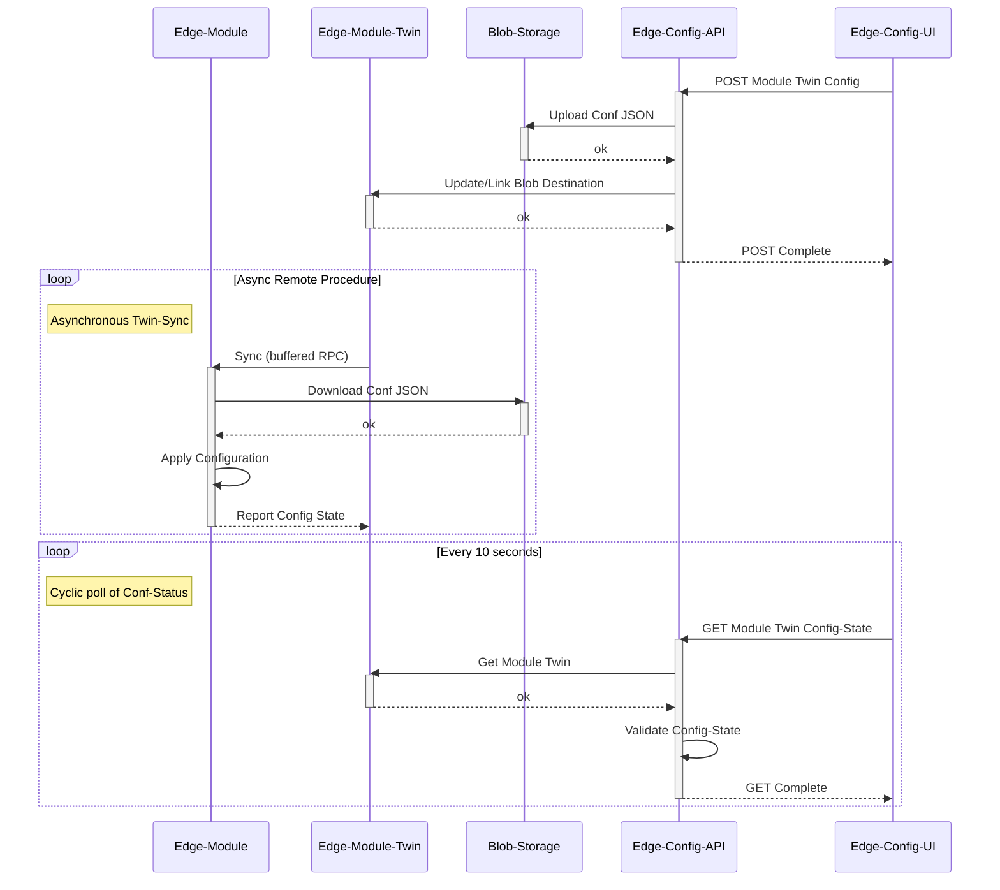

# Architecture

## System overview

The API manages IoT Edge module configurations using two Azure services:
1. **Azure Blob Storage** holds the actual config files — module twins are capped at 32 KB ([IoTHub quotas](https://learn.microsoft.com/en-us/azure/iot-hub/iot-hub-devguide-quotas-throttling)), so large configs are stored in Blob and only a reference is kept in the twin.
2. **IoT Hub module twins** carry a pre-signed blob URL and a `configId` in their `desired` properties, triggering the edge device to download the updated config asynchronously.

## Config flow



## Module twin data model

Only the IoTHub backend may write `desired`; only the edge module may write `reported`.

```json
{
  "properties": {
    "desired": {
      "configBlobUrl": "<pre-signed https blob link>",
      "configId": "<uuid4>"
    },
    "reported": {
      "configId": "<uuid4>",
      "config": {
        "status": true,
        "message": "config status message"
      }
    }
  }
}
```

## Config status

The API derives `confStatus` by comparing `desired.configId` and `reported.configId`:
| Condition | Status |
|---|---|
| `desired` is `null` / missing | `NO_CONFIG` |
| `desired` == `reported` | `OK` |
| `desired` != `reported` | `PENDING` |
| `reported` is `null` / missing | `INITIAL_PENDING` |
`appStatus` maps `reported.config.status` to `OK` / `ERROR` / `NO_STATUS`.

API response type:

```python
class ConfigStatus(BaseModel):
    desiredConfId:  Union[str, None]
    reportedConfId: Union[str, None]
    confStatus:     Literal["OK", "NO_CONFIG", "PENDING", "INITIAL_PENDING"]
    appStatus:      Literal["OK", "ERROR", "NO_STATUS"]
    appMessage:     Union[str, None]
```

## Deployment architecture

Devices are targeted by IoT Hub deployment conditions based on device-twin tags:

```json
{
  "deployment": "base",
  "description": "Service Kempten Uwe",
  "customer": "Test Customer",
  "geoLocation": "47.737315601756144,10.339716700209028"
}
```
The base deployment targets all devices via `tags.deployment='base'` and rolls out a standard container set.
